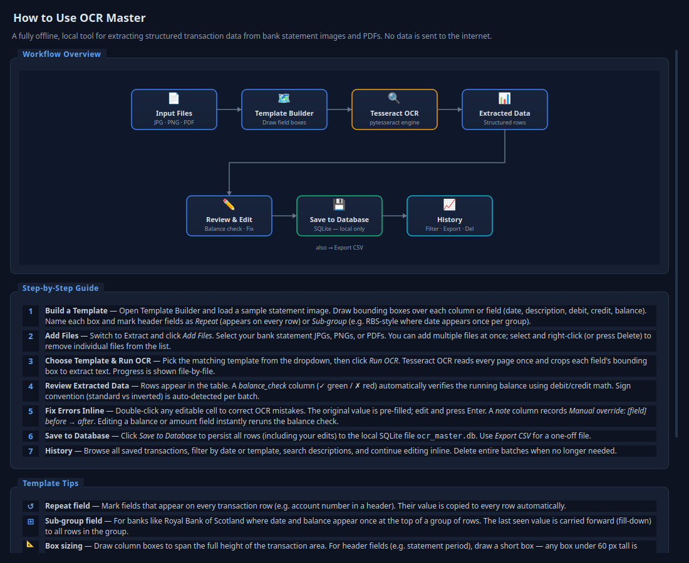

# OCR Master — Bank Statement Extractor

A fully local, offline desktop application for extracting structured transaction data from bank statement images and PDFs. No cloud, no AI APIs, no data ever leaves your machine.

## Screenshot


## How It Works



## Features

- **Visual template builder** — load a sample statement image, draw bounding boxes over each field (date, description, debit, credit, balance), label and save as a named template
- **Multi-bank support** — create one template per bank layout; assign the right template at extract time. A `SaiminBank` example template is included to get started.
- **Repeat & Sub-group fields** — mark header fields as *Repeat* (value copied to every row) or *Sub-group* (fill-down for banks like RBS where date/balance appear once per row group)
- **Tesseract OCR extraction** — runs once per page for performance; bounding-box crops map text to fields
- **Single-file Extract** — add files manually, review and edit the table inline before saving to the database
- **Batch Processing** — point at a folder of statement files; all process under one shared batch name; each file moves to a `batch_complete/` folder after saving; run log shows per-file outcome
- **Balance validation** — auto-computed `balance_check` column (✓ green / ✗ red) verifies running balance using debit/credit math; sign convention auto-detected per batch; reruns instantly when any amount cell is edited
- **Inline editing** — double-click any cell to correct OCR errors; original value pre-filled; note column auto-stamped with `Manual override: [field] 'before' → 'after'`
- **SQLite storage** — all transactions stored locally in `ocr_master.db`
- **CSV export** — export any filtered view to a flat file
- **History & search** — query by date range, template, or keyword; continue editing saved transactions; delete batches

---

## Windows — Install for end users

**Just run `OCRMasterSetup.exe`** — that single file installs everything.

The installer:
- Installs the app to `C:\Program Files\OCR Master\`
- Offers to install Tesseract OCR automatically (via winget) or manually
- Creates Start Menu + optional Desktop shortcuts
- Stores user data (templates, history, settings) in `%APPDATA%\OCR Master\` — writable without admin rights, safe across upgrades
- Includes a full uninstaller (via Windows Settings → Apps); on uninstall it asks whether to keep or delete your data

> Tesseract auto-install requires Windows 10 (1809+) or Windows 11.
> Older systems: choose "Install manually" — the installer opens the download page for you.

See [docs/Windows_Install_Instructions.md](docs/Windows_Install_Instructions.md) to build `OCRMasterSetup.exe` from source.

---

## Windows — Build the installer from source

### Prerequisites (build machine only)

| Tool | Where | Notes |
|---|---|---|
| **Python 3.11+** | https://www.python.org/downloads/ | Check "Add Python to PATH" |
| **Inno Setup 6** | https://jrsoftware.org/isinfo.php | Free; creates the installer EXE |

Tesseract is **not** needed on the build machine — the installer handles it for end users.

### One command

Double-click `build\build_windows.bat`, or from a terminal:

```powershell
powershell -ExecutionPolicy Bypass -File build\build_windows.ps1
```

This automatically:
1. Installs all Python dependencies
2. Runs PyInstaller → `dist\OCRMaster\OCRMaster.exe`
3. Compiles Inno Setup → `build\Output\OCRMasterSetup.exe`

Test `dist\OCRMaster\OCRMaster.exe` first, then distribute `build\Output\OCRMasterSetup.exe`.

---

## Linux / macOS — Run from source

```bash
# Install system dependency
sudo apt-get install -y tesseract-ocr   # Debian/Ubuntu
brew install tesseract                   # macOS

# Install Python packages
pip install -r requirements.txt

# Run
python3 app.py
# or
./run_in_linux.sh
```

---

## Workflow

1. **Template Builder** — open a sample statement image, draw boxes over each field column, name them, set Repeat/Sub-group flags as needed, and save the template
2. **Extract** (single run) — add files, choose the template, click *Run OCR*; review and edit the extracted table inline; save to database or export CSV
3. **Batch** (folder run) — drop all statement files into `batch_import/`, select the template, optionally edit the batch name, click *Start Batch*; each file is processed and moved to `batch_complete/` automatically
4. **History** — filter by date, template, or keyword; continue editing rows; delete batches when no longer needed

---

## User data locations

| Mode | Location |
|---|---|
| Installed (Windows) | `%APPDATA%\OCR Master\` |
| Development | repo root |

Contents: `templates/` (JSON), `ocr_master.db` (SQLite), `config.json` (Tesseract path), `input_files/`, `output/`

---

## Security

- Runs entirely on your local machine — no network connections made
- No data sent to any external service, cloud, or AI
- PDFs and images processed in memory only
- SQLite database file stays on your machine

---

## Supported File Types

- JPEG / PNG — scanned or photographed statement images
- PDF — scanned or digital statements (multi-page supported, rendered at 300 DPI)
