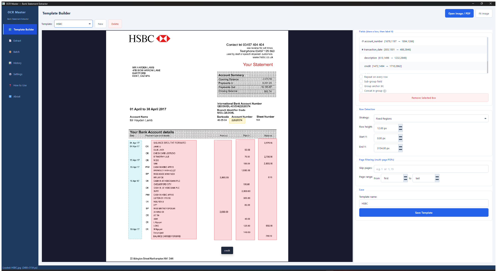

# OCR Master — Bank Statement Extractor

> **Experiment:** This project was built entirely using **VS Code + Claude Code** (Anthropic's AI coding assistant) — from blank repo to a fully functional PyQt6 desktop application, Windows `.exe` installer, and a documented path to Microsoft Store publishing.
>
> **Finding:** AI-assisted coding delivers remarkable speed in the first 80% — architecture, core logic, UI layout, and build pipeline all came together rapidly. The remaining 20% — true polish, edge-case handling, and production-grade fit-and-finish — proved to take as much effort as the first 80%. A classic Tortoise and Hare dynamic: fast out of the gate, but the finish line moves.

---

> **Disclaimer — Please Read**
>
> OCR Master is a **working proof of concept and technology demonstrator** showcasing AI-assisted software development. It is provided as-is with **no expressed or implied warranty** of any kind. Use at your own risk.
>
> The app is designed to process files locally on your device, but **no guarantee is made** regarding data privacy, security, or the absence of network activity. You are responsible for verifying the app's behaviour in your environment before using it with sensitive financial documents. The developer accepts no liability for any loss, data breach, or damage arising from use of this software.

---

A desktop application for extracting structured transaction data from bank statement images and PDFs, designed to run locally on your machine.

## Screenshot



---

## Features

- **Visual template builder** — load a sample statement image, draw bounding boxes over each field (date, description, debit, credit, balance), label and save as a named template
- **Undo / redo** — Ctrl+Z / Ctrl+Shift+Z in the Template Builder canvas; covers add, delete, move, resize, and flag changes
- **Multi-bank support** — create one template per bank layout; a `SaiminBank` example template is included
- **Field flags** — mark fields as *Repeat* (header copied to every row), *Sub-group* (fill-down for banks where date/balance appear once per group), *Group Anchor* (signals a new transaction), *Concat in group* (join multi-line descriptions), or *Currency* (reconstruct 2-decimal amounts when OCR drops the decimal point or thousands comma)
- **Date format per field** — specify the source format (`DD MMM YY`, `DD/MM/YYYY`, `M/D/YY`, etc.) so the extractor validates day ≤ 31 and month ≤ 12; month abbreviations fuzzy-matched to handle OCR misreads; unparseable dates shown in red
- **Tesseract OCR** — runs once per page; bounding-box crops map extracted text to fields
- **Single-file Extract** — add files manually, review and edit the table inline before saving; columns always ordered: `#` | date | description | credit | debit | balance | balance_check
- **Batch Processing** — point at a folder; all files process under one batch name; each file moves to `batch_complete/` on success
- **Balance validation** — auto-computed `balance_check` column (✓ green / ✗ red); sign convention auto-detected; reruns on every cell edit
- **Inline editing** — double-click any cell to correct OCR errors; note column auto-stamped with before/after; date cells that failed to parse to ISO format are highlighted red
- **Transaction Report** — filter by date range, template, or keyword; edit inline; delete batches; export CSV
- **Database tab** — browse `transactions` and `import_log` tables with row counts; delete individual import_log entries to re-enable re-extraction of specific files; export any table to CSV
- **Duplicate detection** — re-running the same file after deleting its batch now works correctly; delete batch clears both `transactions` and `import_log`
- **Configurable paths** — all 7 data paths (Tesseract, database, templates, input, output, batch folders) are user-configurable in Settings
- **SQLite storage** — all transactions stored locally; full raw field data preserved in JSON alongside fixed columns
- **CSV export** — export any filtered view

---

## Navigation

| Page | Purpose |
|------|---------|
| Template Builder | Draw field boxes on a sample image, save as a reusable template |
| Extract | Single-file or multi-file OCR extraction with inline editing |
| Batch | Process an entire folder automatically |
| Report | Query, filter, edit, and export saved transactions |
| Database | Browse raw tables, inspect import log, fix duplicate detection |
| Settings | Configure all 7 data paths and manage templates |

---

## Windows — Run from source (developers / testers)

Double-click `setup_windows.bat`. It will:

1. Check for Python 3.11 — offer to install via winget if missing
2. Install all pip dependencies from `requirements.txt`
3. Check for Tesseract OCR — offer to install via winget if missing
4. Write `config.json` with the Tesseract path

Then double-click `run_in_windows.bat` to launch.

### Share with another developer

Double-click `create_dev_zip.bat` — produces a clean dated zip of all source files (no database, no user data, no build output) that the other developer can unzip and run with the same steps above.

---

## Windows — Install (end users)

**Run `OCRMasterSetup.exe`** — one file installs everything, including Tesseract OCR.

The installer:
- Installs the app **and a bundled copy of Tesseract OCR** to `C:\Program Files\OCR Master\` — no separate Tesseract download needed
- Lets you choose where all user files are stored — default: `Documents\OCR Master\`
- Creates Start Menu + optional Desktop shortcuts
- Full uninstaller via Windows Settings → Apps; on uninstall asks whether to keep or delete your data

---

## Windows — Install (Microsoft Store)

Install from the Microsoft Store. Tesseract OCR is bundled inside the Store package — no additional setup is required.

---

## Windows — Build from source

Double-click `build\build_windows.bat`, or from a terminal:

```powershell
powershell -ExecutionPolicy Bypass -File build\build_windows.ps1
```

The script cleans previous output, installs dependencies, runs PyInstaller, **bundles Tesseract** from the build machine into `dist\OCRMaster\tesseract\`, and compiles the Inno Setup installer automatically.

**Output:** `build\Output\OCRMasterSetup.exe` — this is the file you distribute.

> Tesseract must be installed on the build machine (`winget install UB-Mannheim.TesseractOCR`). It is bundled automatically at build time — end users do not need it.

See [docs/Windows_Install_Instructions.md](docs/Windows_Install_Instructions.md) for full prerequisites and step-by-step detail.

---

## Linux / macOS — Run from source

```bash
sudo apt-get install -y tesseract-ocr   # Debian/Ubuntu
brew install tesseract                   # macOS

pip install -r requirements.txt
python3 app.py
```

---

## Workflow

1. **Template Builder** — open a sample statement image, draw boxes over each column, name and configure fields, save the template
2. **Extract** — add files, pick the template, run OCR, review and edit inline, save to database or export CSV
3. **Batch** — drop files into the import folder, pick the template, click *Start Batch*; files are processed and moved automatically
4. **Report** — filter, search, edit, and export saved transactions
5. **Database** — inspect raw table contents; delete import_log entries if a file needs to be re-extracted

---

## User data locations (all configurable in Settings)

| Mode | All user data |
|------|--------------|
| Installed (`.exe`) | `Documents\OCR Master\` |
| Development (`python app.py`) | Repo root |

All 7 paths (Tesseract binary, database, templates, input, output, batch import, batch complete) default to subdirectories under `Documents\OCR Master\` in the installed build and can be changed under **Settings → Paths & Locations** without restarting the app.

---

## Supported File Types

| Format | Notes |
|--------|-------|
| JPEG / PNG | Scanned or photographed statement images |
| PDF | Scanned or digital; multi-page supported, rendered at 300 DPI |

---

## Microsoft Store

The app is structured for MSIX packaging and Store submission. The binary output from PyInstaller can be wrapped with the MSIX Packaging Tool and submitted via Microsoft Partner Center. This step is documented but not yet completed — it remains part of the original experiment scope.

---

## Tech Stack

| Layer | Technology |
|-------|-----------|
| UI | PyQt6 (Qt 6) |
| OCR | Tesseract + pytesseract |
| PDF rendering | PyMuPDF (fitz) at 300 DPI |
| Data | pandas + SQLite |
| Packaging | PyInstaller + Inno Setup 6 |
| Language | Python 3.11+ |
